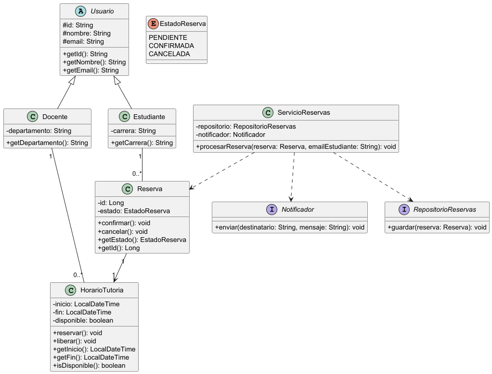

# Sistema de Gestión de Tutorías

## 1. Descripción del Problema
Este proyecto implementa el diseño orientado a objetos para el núcleo de un sistema de gestión de tutorías académicas. Su propósito es permitir que los docentes publiquen su disponibilidad y los estudiantes reserven citas, protegiendo las reglas de negocio (como evitar que un horario se reserve dos veces) y manteniendo una arquitectura altamente cohesiva y con bajo acoplamiento.

## 2. Clases Principales y Responsabilidades
El dominio se ha diseñado distribuyendo las responsabilidades para evitar una "Clase Dios":
* **Usuario (Abstracta):** Centraliza la identidad común (ID, nombre, correo).
* **Estudiante:** Representa al solicitante de la tutoría.
* **Docente:** Administra y publica su disponibilidad de tiempo.
* **HorarioTutoria:** Encapsula el bloque de tiempo y protege la regla de disponibilidad.
* **Reserva:** Gestiona el ciclo de vida de la cita y sus transiciones de estado.
* **ServicioReservas:** Orquesta el caso de uso central sin acoplarse a detalles de infraestructura.

## 3. Decisiones de Diseño y Principios SOLID Aplicados
* **Principio de Responsabilidad Única (SRP):** Cada clase controla su propio estado. Por ejemplo, `Reserva` es la única encargada de evaluarse a sí misma antes de cambiar a estado `CONFIRMADA` o `CANCELADA`.
* **Principio de Inversión de Dependencias (DIP):** El `ServicioReservas` no depende de clases concretas para la base de datos o correos, sino que depende de las interfaces `RepositorioReservas` y `Notificador`.
* **Principio Abierto/Cerrado (OCP):** Gracias a las interfaces, es posible agregar nuevos mecanismos de notificación en el futuro (ej. SMS o WhatsApp) sin modificar la lógica principal de `ServicioReservas`.

## 4. Diagrama UML de Clases
El diseño visual de la arquitectura se encuentra en la carpeta de documentación:


## 5. Ejecución y Compilación
Para verificar que el código compila correctamente sin errores de sintaxis, ejecute el siguiente comando de Maven en la terminal:
```bash
mvn clean test